## Manuális tesztelés
Ezen feladat célja a játék funkcióinak manuélis tesztelése, és a játékban előforduló esetleges hibák feltárása.

### 1. Mozgás tesztelése (Molnár Márton)
Ezen feladat célja a játékossal való mozgás tesztelése.

A játék elindítása után az aktív játékossal rákattintottam egy csőre, majd megynomtam a "mozgás" gombot.
Külön figyelemmel kitértem arra, hogy a mozgatás csak azon játékelemekre múködjön, melyek a melett az elem mellett vannak,
amelyen az aktív játékos éppen áll. A funkció helyesen működött, megtörtént a lépés.

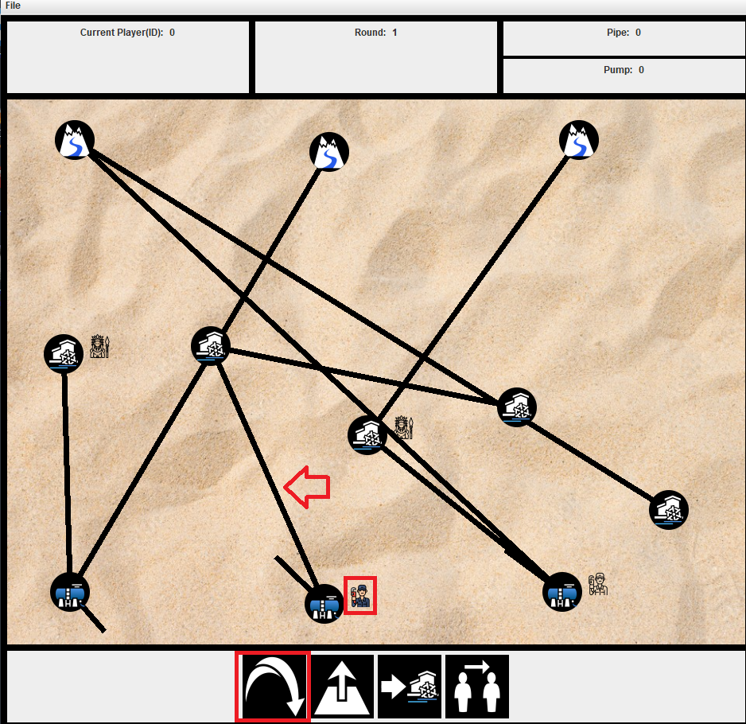

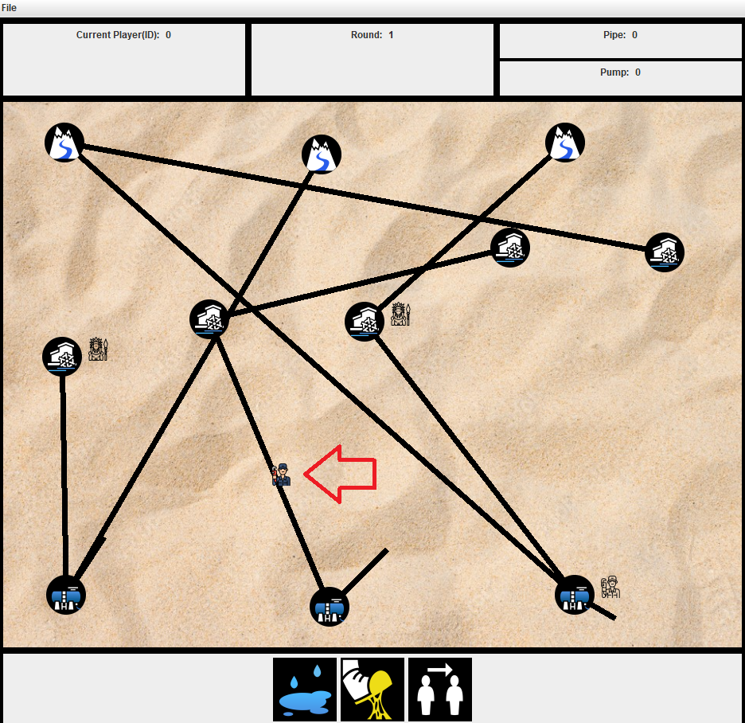

### 2. Pumpa felvétel tesztelése (Molnár Márton)
Ezen feladat célja a szerelővel történő pumpa felvétel tesztelése.

A játék elindítása után az aktív szrelő játékossal rákattintottam a pumpa felvétel gombra.
Ekkor a pumpa felvétele sikeresen megtörtént.
Az felvett pumpák száma a játék ablakának jobb felső sarkában látható.

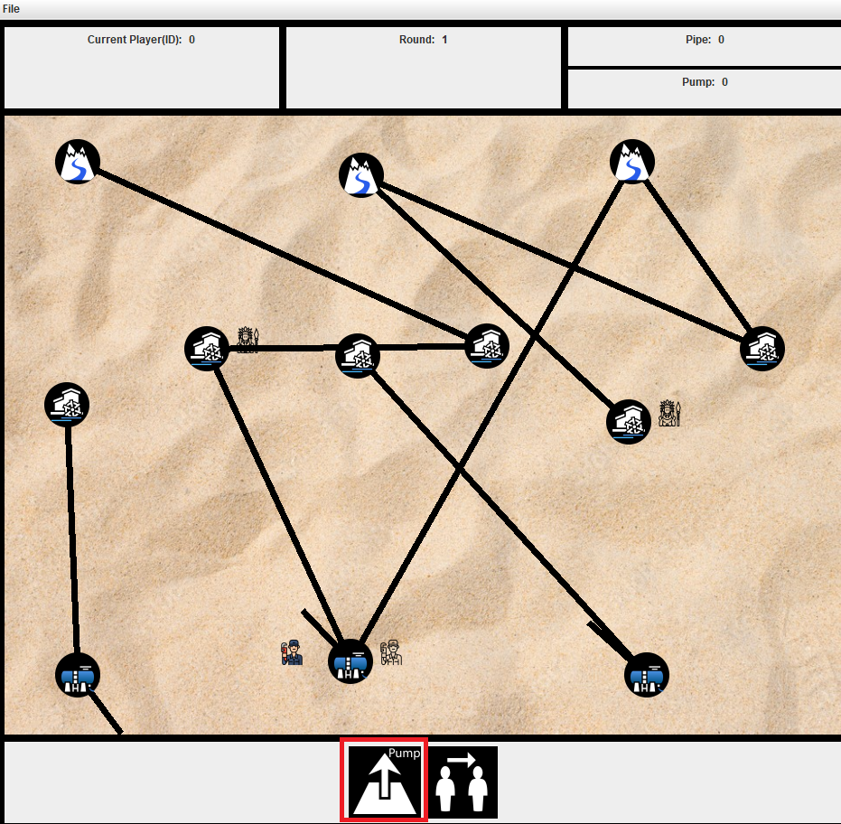

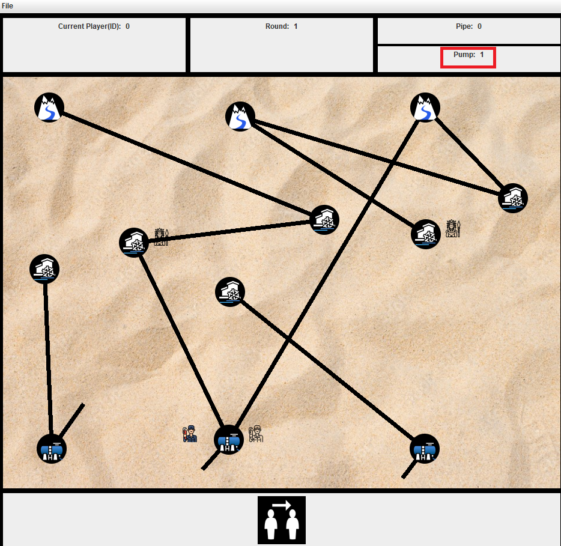

### 3. Pumpa lerakás tesztelése. (Molnár Márton)
Ezen feladat célja a szerelővel történő pumpa lerakás tesztelése volt.
Először is ráléptem egy csőre, majd megynomtam a "pumppa lerakása" gombot.

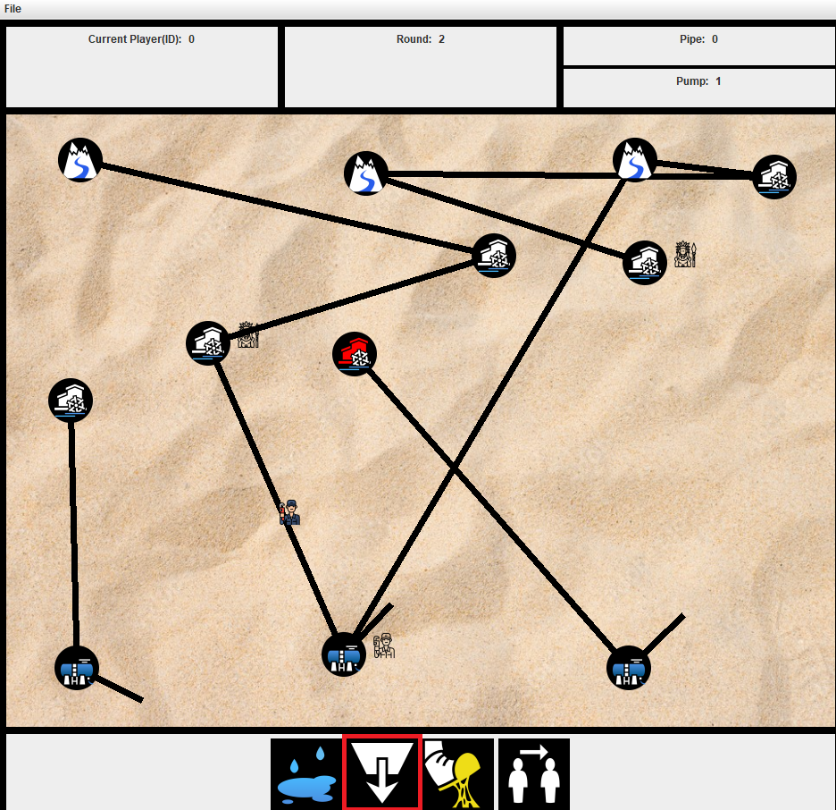

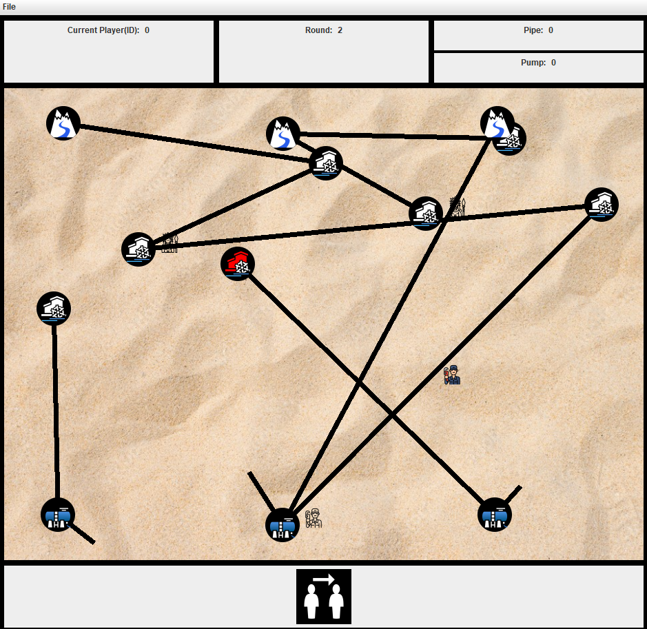

Ekkor a pumpa lerakása sikeresen megtörtént.
A játéktér véltozásait nehéz felgoni, mivel a program minden egyes lépés után újra kirajzolja a játékteret
és véletlenszerű pozícióba helyezi annak elemeit.

### 4. Pumpa javítás tesztelése (Molnár Márton)
Ezen feladat célja az elromlott pumpák javításának tesztelése volt.
Az elromlott pumpkat a játék piros színnel megjelöli.
A teszteléshez egy szerelővel rááltam egy elromlott pumpára, majd megnyomtam a "szerelés" gombot.

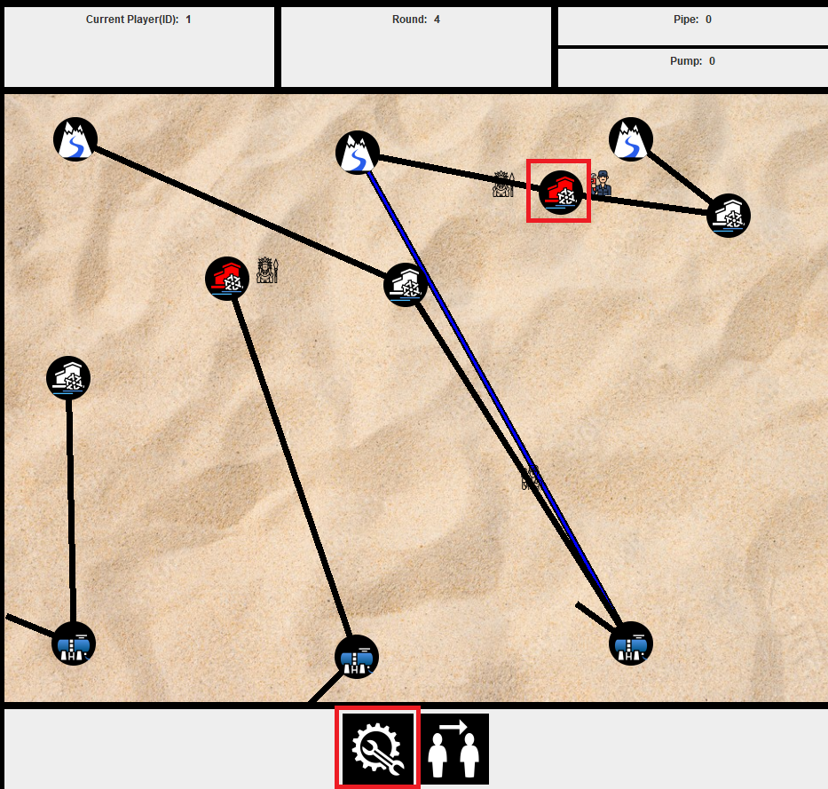

A pumpa javítása ekkor sikeresen megtörtént, a pumpa ismét működőképessé vált.

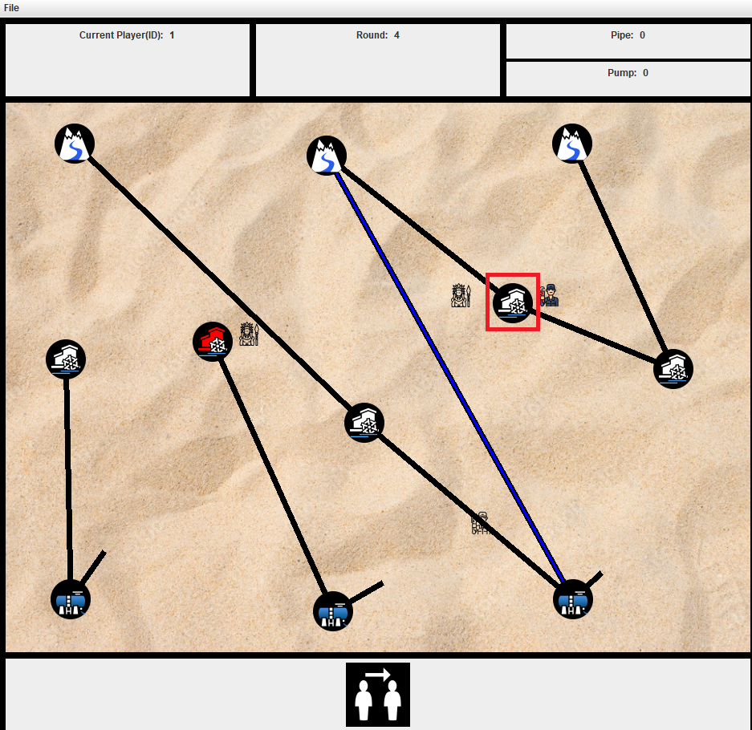

### 5. Pumpa állítás tesztelése (Molnár Márton)
Pumpán, forráson vagy ciszternán állva lehetősége van a játkosoknak a víz folyásának irányát állítani.
Ha egy csőben épp folyik víz, azt kék színnel színezi ki a program.
A teszteléshez egy szerelővel ráálltam egy forrásra, majd beállítottam a vízfolyás irányát.
A teszt sikeres volt, a játéktéren a cső kék színű lett.

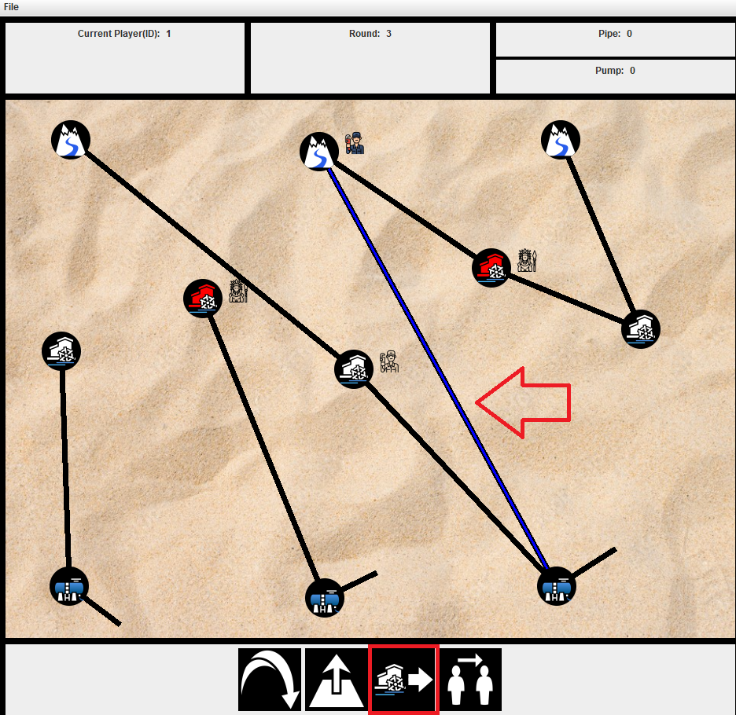

### 6. Cső javítás tesztelése (Molnár Márton)
Ezen feladat célja a szabotőr által kilyukasztott csövek szerelő általi javításának tesztelése.

Ehhez először egy szabotőrrel kilyukasztottam egy csövet, amely ekkor piro színűvé vált, jelezve a lyukas állapotát.

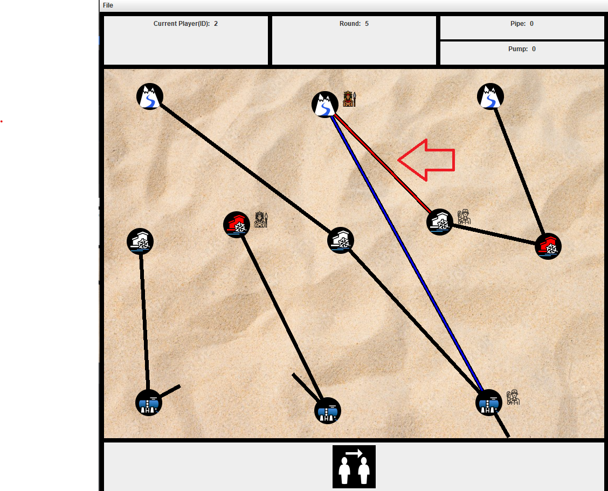

Eztuán egy szerelővel ráálltam az előbb kilyukasztott csőre és megnyomtam a "szerelés" gombot.

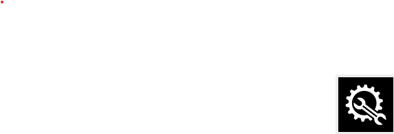

Eztuán a cső ismét képessé vált a víz továbbítására.

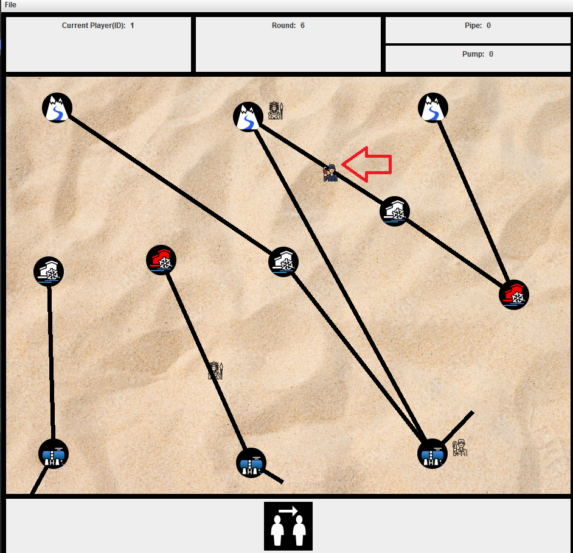