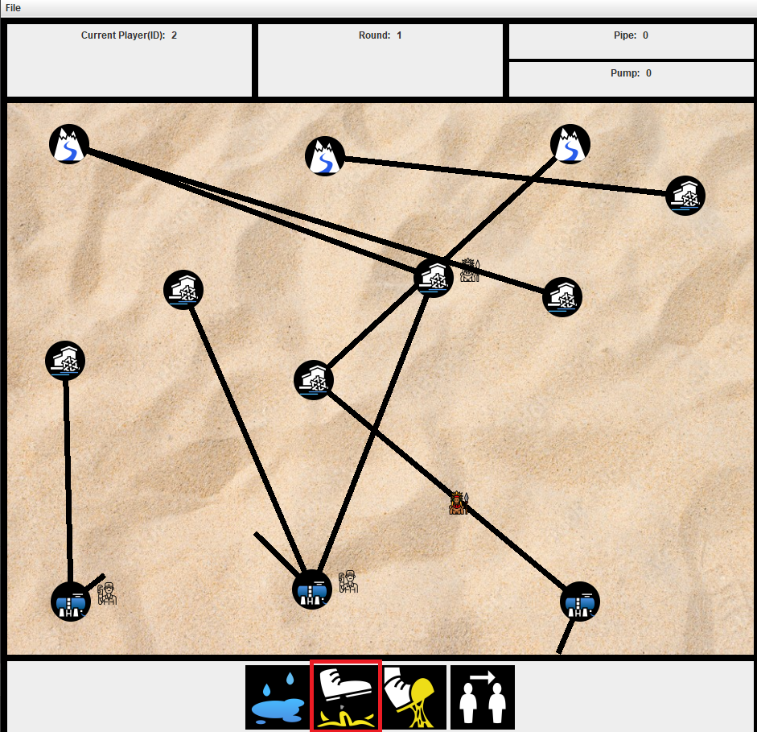

## Manuális tesztelés
Ezen feladat célja a játék funkcióinak manuélis tesztelése, és a játékban előforduló esetleges hibák feltárása.

### 1. Mozgás tesztelése (Molnár Márton)
Ezen feladat célja a játékossal való mozgás tesztelése.

A játék elindítása után az aktív játékossal rákattintottam egy csőre, majd megynomtam a "mozgás" gombot.
Külön figyelemmel kitértem arra, hogy a mozgatás csak azon játékelemekre múködjön, melyek amellett az elem mellett vannak,
amelyen az aktív játékos éppen áll. A funkció helyesen működött, megtörtént a lépés.

### 2. Pumpa felvétel tesztelése (Molnár Márton)
Ezen feladat célja a szerelővel történő pumpa felvétel tesztelése.

A játék elindítása után az aktív szrelő játékossal rákattintottam a pumpa felvétel gombra.
Ekkor a pumpa felvétele sikeresen megtörtént.
Az felvett pumpák száma a játék ablakának jobb felső sarkában látható.

### 3. Pumpa lerakás tesztelése. (Molnár Márton)
Ezen feladat célja a szerelővel történő pumpa lerakás tesztelése volt.
Először is ráléptem egy csőre, majd megynomtam a "pumppa lerakása" gombot.

Ekkor a pumpa lerakása sikeresen megtörtént.
A játéktér véltozásait nehéz felgoni, mivel a program minden egyes lépés után újra kirajzolja a játékteret
és véletlenszerű pozícióba helyezi annak elemeit.

### 4. Pumpa javítás tesztelése (Molnár Márton)
Ezen feladat célja az elromlott pumpák javításának tesztelése volt.
Az elromlott pumpkat a játék piros színnel megjelöli.
A teszteléshez egy szerelővel rááltam egy elromlott pumpára, majd megnyomtam a "szerelés" gombot.

A pumpa javítása ekkor sikeresen megtörtént, a pumpa ismét működőképessé vált.

### 5. Pumpa állítás tesztelése (Molnár Márton)
Pumpán, forráson vagy ciszternán állva lehetősége van a játkosoknak a víz folyásának irányát állítani.
Ha egy csőben épp folyik víz, azt kék színnel színezi ki a program.
A teszteléshez egy szerelővel ráálltam egy forrásra, majd beállítottam a vízfolyás irányát.
A teszt sikeres volt, a játéktéren a cső kék színű lett.

### 6. Cső javítás tesztelése (Molnár Márton)
Ezen feladat célja a szabotőr által kilyukasztott csövek szerelő általi javításának tesztelése.

Ehhez először egy szabotőrrel kilyukasztottam egy csövet, amely ekkor piro színűvé vált, jelezve a lyukas állapotát.

Eztuán egy szerelővel ráálltam az előbb kilyukasztott csőre és megnyomtam a "szerelés" gombot.

Eztuán a cső ismét képessé vált a víz továbbítására.

### 7. Szabotőrrel való lépés (Czifra Barnabás)
Ezen feladat célja a szabotőr lépés sikerességének tesztelése.

Amikor a szabotőr volt az aktív játékos (színnel kitöltött a figurája), rákattintottam az előtte álló csőre, majd kiválasztottam a lépés opciót. A szabotőr áthelyeződött a pumpáról a csőre, sikeresen megtörtént a lépés.

A lépés eredménye:

### 8. Szabotőr csúszóssá teszi a csövet (Czifra Barnabás)
Ezen feladat célja a szabotőr azon tevékenysége, amikor csúszóssá teszi a csövet. Ennek elvárt eredménye, hogy aki rálépne a csőre, az ne tudjon, hanem tovább csússzon a cső végén elhelyezkedő pumpára.

Amikor a szabotőr az aktív játékos, és rajta álló csövön kattittunk, kit tudjuk választani, hogy  szabotőr milyen tevékenységet végezzen. Kiválasztva a csúszóssá tevés funkciót, a cső sárgára színeződik, ezzel mutatva, hogy csúszóssá vált a cső.

A csövön állva csúszóssá tevés funckió kiválasztása:

A lépés eredménye:

Most pedig nézzük meg, mi az eredménye, ha egy szerelővel megpróbálunk rálépni a csúszós csőre:

A lépés eredménye:

Láthatjuk, hogy a szerelő nem a csőre lépett, hanem a pumpára. A cső csúszóssága az elvárt eredményt hozta, valóban az történt, amit elvártunk: a szerelő tovább csúszott a pumpára.

### 9. Szabotőr ragadóssá teszi a csövet (Czifra Barnabás)

A feladat célja a szabotőr azon tevékenysége, amikor ragadóssá tesz egy csövet. Ennek elvárt eredménye, hogy aki arra a csőre rálép, az ne tudjon továbbhmenni (tehát maga a szabotőr sem).

Amikor a szabotőr az aktív játékos, és rajta álló csövön kattittunk, kit tudjuk választani, hogy  szabotőr milyen tevékenységet végezzen. Kiválasztva a ragadóssá tevés funkciót, a cső zöldre színeződik, ezzel mutatva, hogy ragadóssá vált a cső.

A csövön állva ragadóssá tevés funckió kiválasztása:

A cső ragadóssá vált:

Most pedig nézzük meg, mi az eredménye, ha a szabotőrrel megpróbálunk továbblépni a ragadós csőről:

A cső végén lévő pumpára kattintva alap esetben ott lenne a továbblépés ikon, de most nincs. Ez bizonyítj a raggadós cső helyes működését, miszerint a rajta álló játékost nem engedi tovább lépni.