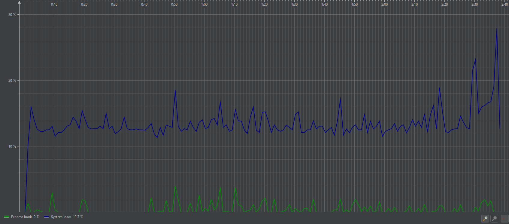
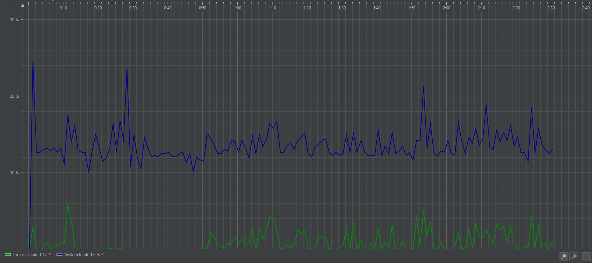
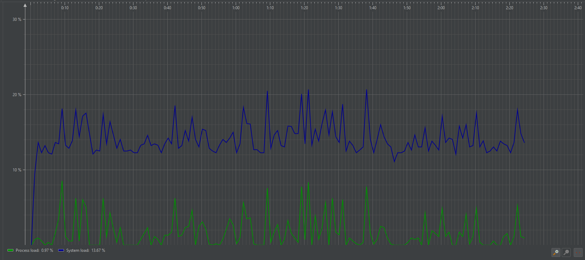
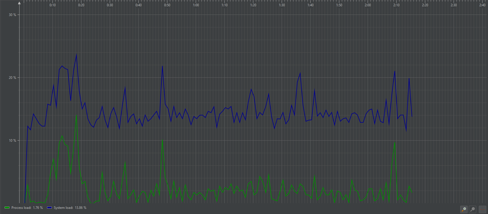

## Hardver erőforrások mérése
A hardver erőforrások kihasználtságának, teljesítméynenek mérésére a JProfiler-t használtuk:

### 1. RAM használat (Czifra Barnabás)

Az ábrán látható a memória felhasználása a játék során. A kékkel jelölt terület a használt memória mennyiségét, míg a zölddel jelölt terület az allokált, de éppen nem használt RAM-ot mutatja. Ahogy láthatjuk, a RAM használata növekszik a játék során, majd visszaesik. A növekedést azzal értük el, hogy plusz játékelemeket (pl. pumpákat) helyeztünk el a pályán. A csökkenést felhasználó interakciók hiányában a következők miatt lehetséges:

- Garbage Collector működése: A Garbage Collector (GC) a nem használt objektumokat gyűjti össze és szabadítja fel az általuk foglalt memóriaterületet, ami a használt RAM mennyiségének csökkenését eredményezi.

- VM (Java Virtual Machine) Dinamikus Erőforrás Kezelése: A JVM dinamikusan kezeli az erőforrásokat, és kihasználja a lehetőségeket a memória visszanyerésére. Amikor a terhelés csökken, a JVM visszavonhat memóriaterületeket a játék számára.

Diagram Elemzése

Az ábra két részből áll:

- Memória használat (Memory):
- Kék terület: A ténylegesen használt memória, amely a játék futása során növekszik, ahogy új játékelemek kerülnek be, és csökken, amikor a GC felszabadítja a már nem szükséges memóriaterületeket.
- Zöld terület: Az allokált, de éppen nem használt memória, amelyet a JVM a játék számára előre lefoglalt, de jelenleg nem használ aktívan.

- Garbage Collector Aktivitás (GC Activity):
        A zöld vonal jelzi a GC aktivitását. Láthatjuk, hogy a GC aktivitása gyakran egybeesik a használt RAM mennyiségének csökkenésével, ami arra utal, hogy a GC működése során felszabadított memória visszakerül a szabad erőforrások közé.

#### Részletes Megfigyelések

- 0:00 - 0:20: A játék kezdeti fázisában a használt memória gyorsan növekszik, ahogy a játék elemei inicializálódnak.
- 0:20 - 0:40: A RAM használatában kisebb ingadozások figyelhetők meg, ami valószínűleg az új játékelemek hozzáadásának és a GC időszakos futásának köszönhető.
- 0:40 - 1:30: Ebben a szakaszban a memória használata stabilizálódik, miközben a GC folyamatosan működik, és felszabadítja a nem használt memóriát.
- 1:30 - 2:20: A memória használata időszakosan csökken, amikor a GC nagyobb mennyiségű memóriát szabadít fel. Ez a szakasz jól mutatja a JVM dinamikus erőforrás-kezelését, ahol a használt memória mennyisége csökken a terhelés csökkenésével párhuzamosan.

#### Következtetések

Az ábra alapján megállapítható, hogy a játék memóriahasználata dinamikusan változik a játékelemek és a felhasználói interakciók függvényében. A Garbage Collector működése kulcsfontosságú a memóriahatékonyság szempontjából, mivel a nem használt objektumok eltávolításával optimalizálja a rendelkezésre álló erőforrásokat. A JVM dinamikus erőforrás-kezelése pedig biztosítja, hogy a memóriahasználat a terheléshez igazodjon, és a felesleges memóriaterületek visszavonásával javítja a játék teljesítményét.

A fentiek figyelembevételével érdemes tovább optimalizálni a memóriahasználatot a játék során, különösen a játékelemek hozzáadása és a felhasználói interakciók kezelése terén. A GC és a JVM megfelelő konfigurálása és monitorozása hozzájárulhat a játék teljesítményének javításához és a memóriahatékonyság növeléséhez.

### 2. Szálkezelés (Czifra Barnabás)

#### Az ábrán az alábbi szálállapotok különíthetők el színekkel:

- Zöld (Runnable threads): Futásra kész szálak, amelyek készen állnak arra, hogy CPU időt kapjanak és végrehajtásra kerüljenek.
- Piros (Blocked threads): Blokkolt szálak, amelyek várakoznak egy erőforrásra, amely jelenleg nem elérhető.
- Kék (Threads in Net I/O): Hálózati I/O műveleteket végző szálak, amelyek adatokat küldenek vagy fogadnak.
- Sárga (Waiting threads): Várakozó szálak, amelyek egy feltétel teljesülésére vagy egy jelzésre várnak.
- Barna (Total number of threads): Az összes szál száma.

#### A Diagramon Látható Jelenségek

- (0:00 - 0:25)
        Az elején két várakozó szál látható (sárga), ami arra utal, hogy ezek a szálak még nem kezdtek el futni, hanem valamilyen inicializációra várnak.

- (0:25 - 0:30)
        Hirtelen csökkenés tapasztalható a várakozó szálak számában, és megjelenik egy futó szál (zöld). Ez azt jelzi, hogy a játék elkezdett aktívan futni, és a várakozó szálak közül egy megkapta a CPU időt.

- (0:30 - 1:00)
        Ebben a szakaszban egyetlen futó szál látható, amely periodikusan dolgozik. Ez az állapot stabil, és arra utal, hogy a játék főszála aktívan végzi a feladatait.

- (1:00 - 2:00)
        Ezen a részen a szálak száma és állapota ingadozik. Gyakori átmenetek figyelhetők meg a várakozó (sárga) és futó (zöld) szálak között. Ez arra utal, hogy a játék dinamikusan kezeli a szálakat, valószínűleg különböző események és erőforrás-hozzáférések függvényében.

#### Következtetések

- Várakozó Szálak Magas Száma: A mérés kezdetén mind a két szál várakozik, a játék két szálat indít el egyszerre, de ezek közül egyik sem kap azonnal CPU időt.
- Futó Szálak Dinamikus Kezelése: Az ingadozó futó szálak száma azt mutatja, hogy a játék képes dinamikusan kezelni a szálak állapotát a játékban bekövetkező események függvényében. Ez lehet hatékony, de egyben okozhat teljesítménybeli problémákat is, ha nem megfelelően van kezelve.
- CPU Időelosztás: A periodikus futó szálak (zöld) megjelenése és eltűnése arra utal, hogy a játék szálai valószínűleg időosztásos módon osztoznak a CPU erőforrásain. Ez egy gyakori megközelítés a több szál kezelése során.

#### Összegzés

Összefoglalva, az ábra a játék szálkezelésének egy dinamikus és komplex képét mutatja. Az inicializációs fázis után a játék szálai különböző állapotokba kerülnek, attól függően, hogy milyen feladatokat kell végrehajtaniuk. A futó szálak számának és állapotának változása azt jelzi, hogy a játék folyamatosan változó terhelést jelent a rendszerre, ami fontos tényező lehet a teljesítmény optimalizálása során. Ezen információk alapján érdemes tovább vizsgálni, hogyan lehetne a szálkezelést hatékonyabbá tenni, hogy minimalizáljuk a várakozási időket és maximalizáljuk a futó szálak kihasználtságát.

### 3. CPU Használat (Molnár Márton)
A CPU használat mérése a program egy Intel Core i7-10610U típusú CPU-n történő futtatása során történt.

A fenti ábrán egy gyors 5 menetes játék során rögzített CPU használat gradfikon látható.
A játék a következő paraméterekkel történt:
- 2 Szabotőr
- 2 Szerelő
- 3 Forrás
- 5 Pumpa
- 3 Ciszterna

A játékmenet során nem helyeztem el új elemeket a pályán.
A grafikonon kék színnel rajzolódik ki a CPU teljes terhelése.
Zöld színnel pedig a játék CPU használata.
A grafikonon 20 és 40 másodperc között láható, hogy a játék nem használta a CPU-t.
Ez azért történt, mivel abban az idősávban nem nyúltam a játéhoz.

Ezután a játékot megismételtem a következő paraméterekkel:
- 5 Szabotőr
- 5 Szerelő
- 6 Forrás
- 10 Pumpa
- 6 Ciszterna

A fenti ábrán látható, hogy ekkor megnövekedett a játék CPU használata.
A lépések már érezhetően lassabban történtek meg, de a játék még teljesen játszható volt.

Ezután a játékot megismételtem a következő paraméterekkel:
- 10 Szabotőr
- 10 Szerelő
- 11 Forrás
- 20 Pumpa
- 11 Ciszterna

Ahogy a fenti ábrán látható, a CPU terhelés ismét megnövekedett.
A játék lépései már igen lassan történtek meg, de a játék még így is játszható maradt.

Ezután a játékot lefuttattam még egyszer, 100-100 játékossal.

Ebben az esetben a CPU használat nem nőtt meg extrém módon, azonban a játék szinte játszhatatlanná vált,
nem csupán azért, mivel a játékelemek mennyisége kezelhetetlen mértékű lett, hanem mivel a játék lépései igencsak lassúvá váltak.

#### Következtetések
- A játék minden egyes körben kirajzolja a játéktér összes elemét újra, amely rengetek értékes CPU időt használ fel.
- A játék egy szálon fut, ezért a játéktér elemeit csak egymás után tudja kirajzolni, korlátozva ezzel a kirajzolás sebességét.

#### Javaslatok
- A játék minden körben csak a változáson átesett elemeket rajzolja ki, csökkentve ezzel a terhelést a CPU-n.
- A játék többszálúsítása bár nem lenne egyszerű feladat, de nagyban növelné a játék sebességét.