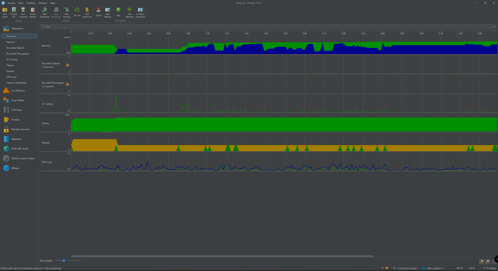
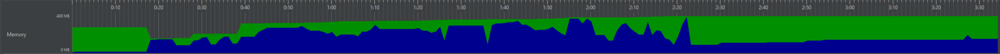
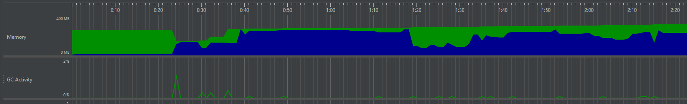
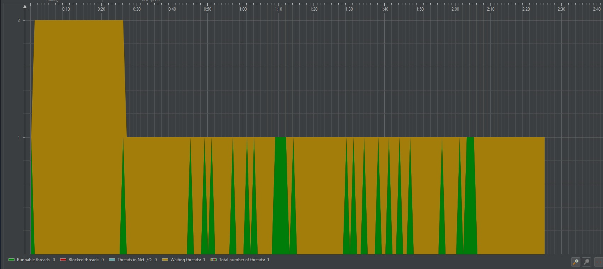

## Hardver erőforrások mérése
A hardver erőforrások kihasználtságának, teljesítméynenek mérésére a JProfiler-t használtuk:

### 1. RAM használat

Kékkel a használt memória mennyisége, zölddel pedig az allokált, de éppen nem használt RAM-ot jelöli az ábra. 
Ahogy láthatjuk, a RAM használat növekszik a játék során, majd visszesik. A növekedést azzal értük el, hogy plusz játékelemeket (pl. pumpákat) helyeztünk el a pályán. A csökkenést felhasználó interakciók hiányában a következők miatt lehtséges: 
- Garbage Collector működése
- JVM (Java Virtual Machine) Dinamikus Erőforrás Kezelése (A JVM dinamikusan kezeli az erőforrásokat, és kihasználja a lehetőségeket a memória visszanyerésére. Amikor a terhelés csökken, a JVM visszavonhat memóriaterületeket a játék számára.)

Mértük a garbage collector műkdödését a RAM-használattal összehasonlítva, és azt láttuk, hogy a használt RAM mennyisége akkor csökken, amikor a GC valamilyen aktivitást végez (szemétgyűjtés):

### 2. Szálkezelés

### Az ábrán az alábbi szálállapotok különíthetők el színekkel:

- Zöld (Runnable threads): Futásra kész szálak, amelyek készen állnak arra, hogy CPU időt kapjanak és végrehajtásra kerüljenek.
- Piros (Blocked threads): Blokkolt szálak, amelyek várakoznak egy erőforrásra, amely jelenleg nem elérhető.
- Kék (Threads in Net I/O): Hálózati I/O műveleteket végző szálak, amelyek adatokat küldenek vagy fogadnak.
- Sárga (Waiting threads): Várakozó szálak, amelyek egy feltétel teljesülésére vagy egy jelzésre várnak.
- Barna (Total number of threads): Az összes szál száma.

### A Diagramon Látható Jelenségek

- (0:00 - 0:25)
        Az elején két várakozó szál látható (sárga), ami arra utal, hogy ezek a szálak még nem kezdtek el futni, hanem valamilyen inicializációra várnak.

- (0:25 - 0:30)
        Hirtelen csökkenés tapasztalható a várakozó szálak számában, és megjelenik egy futó szál (zöld). Ez azt jelzi, hogy a játék elkezdett aktívan futni, és a várakozó szálak közül egy megkapta a CPU időt.

- (0:30 - 1:00)
        Ebben a szakaszban egyetlen futó szál látható, amely periodikusan dolgozik. Ez az állapot stabil, és arra utal, hogy a játék főszála aktívan végzi a feladatait.

- (1:00 - 2:00)
        Ezen a részen a szálak száma és állapota ingadozik. Gyakori átmenetek figyelhetők meg a várakozó (sárga) és futó (zöld) szálak között. Ez arra utal, hogy a játék dinamikusan kezeli a szálakat, valószínűleg különböző események és erőforrás-hozzáférések függvényében.

### Következtetések

- Várakozó Szálak Magas Száma: A mérés kezdetén mind a két szál várakozik, a játék két szálat indít el egyszerre, de ezek közül egyik sem kap azonnal CPU időt.
- Futó Szálak Dinamikus Kezelése: Az ingadozó futó szálak száma azt mutatja, hogy a játék képes dinamikusan kezelni a szálak állapotát a játékban bekövetkező események függvényében. Ez lehet hatékony, de egyben okozhat teljesítménybeli problémákat is, ha nem megfelelően van kezelve.
- CPU Időelosztás: A periodikus futó szálak (zöld) megjelenése és eltűnése arra utal, hogy a játék szálai valószínűleg időosztásos módon osztoznak a CPU erőforrásain. Ez egy gyakori megközelítés a több szál kezelése során.

### Összegzés

Összefoglalva, az ábra a játék szálkezelésének egy dinamikus és komplex képét mutatja. Az inicializációs fázis után a játék szálai különböző állapotokba kerülnek, attól függően, hogy milyen feladatokat kell végrehajtaniuk. A futó szálak számának és állapotának változása azt jelzi, hogy a játék folyamatosan változó terhelést jelent a rendszerre, ami fontos tényező lehet a teljesítmény optimalizálása során. Ezen információk alapján érdemes tovább vizsgálni, hogyan lehetne a szálkezelést hatékonyabbá tenni, hogy minimalizáljuk a várakozási időket és maximalizáljuk a futó szálak kihasználtságát.