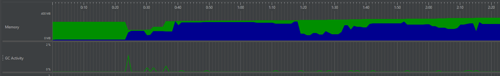

## Hardver erőforrások mérése
A hardver erőforrások kihasználtságának, teljesítméynenek mérésére a JMeter-t használtuk:

### 1. RAM használat

Kékkel a használt memória mennyisége, zölddel pedig a hátralévő RAM-ot jelöli az ábra. 
Ahogy láthatjuk, a RAM növekszik a játék során, majd visszesik. A növekedést azzal értük el, hogy plusz játékelemeket (pl. pumpákat) helyeztünk el a pályán. A csökkenést felhasználó interakciók hiányában a következők miatt lehtséges: 
- Garbage Collector működése
- JVM (Java Virtual Machine) Dinamikus Erőforrás Kezelése (A JVM dinamikusan kezeli az erőforrásokat, és kihasználja a lehetőségeket a memória visszanyerésére. Amikor a terhelés csökken, a JVM visszavonhat memóriaterületeket a játék számára.)

Mértük a garbage collector műkdödését a RAM-használattal összehasonlítva, és azt láttuk, hogy a használt RAM mennyisége akkor csökken, amikor a GC valamilyen aktivitást végez (szemétgyűjtés):

